[](https://github.com/QianyeSu/)<!-- If you want the template for my gif, email me! -->
<!--<p align="center">  </p>
<p align="center">  </p>-->
<p align="center">     </p>

# 👋 Hi, I’m Qianye Su, welcome to my Github

```javascript
const Qianye Su = {
    contact: ["suqianye2000@gmail.com"],
    collaborations: ["palaeoclimate", "machine learning", "tropical atmospheric dynamics"],
    studyingOn: ["Phd student at Guangdong Ocean University..."],
    learning: ["Python", "NCL", "matlab", "Shell", "Javascript", "CSS"],
    askMeAbout: ["Hadley circulation"，"tropical atmospheric dynamics"，"CESM"],
    hobbies: {
        major: {
            indoor: ["cooking","watching animes", "gaming"],
	    outdoor: ["traveling"],
        },
        funFact: {
            secret: ["I freaking love music", "dogs"],
		}
            }
        };
```
<!--
### Languages


-->
## ⚙️ &nbsp;GitHub Analytics

<div align="center">
  <a href="https://github.com/QianyeSu">
    
    
  </a>
</div>

<!--
<p>
  <br>
  <a href="https://github.com/QianyeSu">
    
    
  </a>
  <br>
  <br>
  <a href="https://github.com/QianyeSu">
        
  </a> 
</p>
-->

<p align="center">
  
  
</p>

<!--
## ⚙️ &nbsp;Activity
| Activity time | Commit time |
| --- | --- |
|   |  |
-->


##
<!--
**QianyeSu/QianyeSu** is a ✨ _special_ ✨ repository because its `README.md` (this file) appears on your GitHub profile.
#### 💬 Ask me about anything related to atmosphere science.
#### ⚡ I'm happy to answer any questions about the Hadley Circulation.
Here are some ideas to get you started:
## 👋 Hi, I’m Qianye Su, currently a Master's student at Guangdong Ocean University.
#### 🔭 I’m interested in Hadley Circulation
#### 🌱 I’m currently learning advanced data analysis techniques and exploring their applications in atmospheric science and ocean-atmosphere interactions.
#### 👯 I’m currently studying the Community Earth System Model (CESM).
#### 🤔 I’m looking to collaborate on projects involving tropical atmospheric dynamics, machine learning, paleoclimate.
#### 📫 How to reach me: suqianye2000@gmail.com
#### 😄 Pronouns: He/Him
#### 💬 I'm happy to answer any questions about the Hadley Circulation.

# 
## ⚙️ &nbsp;GitHub Analytics
| My Github Stats | Programming Languages I use |
| --- | --- |
|  |  |
| Activity time | Commit time |
|   |  |

## ⚙️ &nbsp;Activity time

-->
